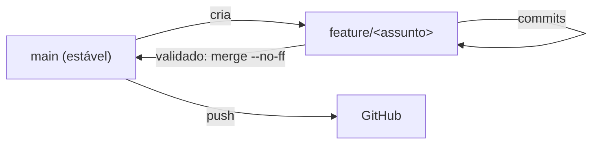

# 🔁 Ritual de Sessão — RADIO_MASTER

Protocolo fixo para começar e encerrar cada sessão de trabalho. Mantém o contexto vivo, o `main` estável e o vault sempre atualizado.

> [!tip] Por que ritualizar
> O projeto evolui em sessões curtas. Abrir relendo o estado e fechar registrando o que foi feito evita "onde eu parei mesmo?" e garante que nada se perca entre um dia e outro.

## 🟢 Ritual de Inicialização

> [!abstract] Objetivo: recarregar o contexto e preparar o ambiente antes de mexer em qualquer coisa.

- [ ] Abrir o vault e ler o [[🧠 MOC - Cérebro RADIO_MASTER|MOC]] (estado atual no topo).
- [ ] Ler a **última entrada** do [[Log de Testes]] para lembrar onde paramos.
- [ ] Revisar as [[Questões em Aberto]] (o que está pendente / em andamento).
- [ ] Sincronizar o código: `git pull` no `main` e conferir o branch atual (`git status`, `git branch`).
- [ ] Se for **código novo**, criar um branch de feature a partir do `main` (ex.: `feature/<assunto>`). Ver [[#Workflow de versionamento]].
- [ ] Definir **o objetivo da sessão** (1 frase) — o que quero ter pronto ao final.

> [!warning] Antes de bancada (hardware)
> - **NÃO** deixar o analisador lógico na linha CRSF (PA9) durante testes de RX — ele carrega o fio single-wire e derruba a recepção. Usar o **dump na USART2** como instrumento. (Lição: [[Log de Testes]] 2026-06-25.)
> - Confirmar **GND comum** entre placa, módulo e adaptador de debug.
> - Terminal da USART2 a **115200**; USB CDC para os comandos JSON.

## 🔴 Ritual de Encerramento

> [!abstract] Objetivo: registrar o que foi feito, validar e versionar antes de sair.

- [ ] Atualizar o [[Log de Testes]] com uma entrada datada (o que mudou, resultado ✅/⚠️/❌, valores medidos).
- [ ] Atualizar notas afetadas: [[Questões em Aberto]] (fechar/avançar itens), ADRs novos em [[ADR-000 Template|Decisões]], e o "Estado atual" do [[🧠 MOC - Cérebro RADIO_MASTER|MOC]].
- [ ] **Validar antes de commitar**: compilar; se possível, testar na bancada. Não commitar código não-compilado como "pronto".
- [ ] Commit no branch de feature → quando validado, **merge no `main`** (`--no-ff`) → `git push` do `main` e do branch.
- [ ] Deixar registrados os **próximos passos** (no Log ou no MOC) para o próximo "ritual de inicialização".

> [!note] Higiene de git/credenciais
> - Token do GitHub: válido por 30 dias. Reusar enquanto vigente; revogar se exposto ou ao expirar.
> - `main` = sempre compilável/validado. Trabalho novo nasce em branch.

## Workflow de versionamento

- Um branch por funcionalidade; mesclar no `main` só após validar na bancada.
- Merge `--no-ff` para deixar explícito no histórico que a feature foi integrada.

> [!info] Nota de ambiente (OneDrive)
> O vault e o código ficam em pasta sincronizada (OneDrive). Em algumas operações de terminal, a visão dos arquivos pode aparecer **desatualizada** (cache desidratado). Se notar isso, reabrir/baixar o arquivo resolve. O conteúdo "verdadeiro" é o que está salvo na pasta.

## Relacionadas
- [[🧠 MOC - Cérebro RADIO_MASTER]] · [[Log de Testes]] · [[Plano de Testes]] · [[Questões em Aberto]]
