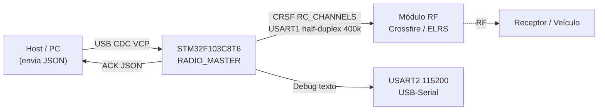

# Visão Geral do Projeto

## Objetivo
O **RADIO_MASTER** é o firmware de uma placa **STM32F103C8T6 (Blue Pill)** que atua como *master*/ponte entre um **host (PC)** e um **módulo de rádio Crossfire/ELRS**.

## Fluxo de dados (resumo)
1. O host envia linhas JSON como `{"direcao":1500,"throttle":1500,"seq":42}` pela porta serial virtual USB.
2. O firmware faz parse, satura para a faixa `1000–2000 µs` e guarda em variáveis `volatile`.
3. A [[Tasks FreeRTOS|task CRSF]] roda a **150 Hz**: converte µs → unidades CRSF, monta o frame [[Protocolo CRSF|RC_CHANNELS]] e transmite por USART1.
4. Devolve um **ACK JSON** ao host por USB CDC.
5. Se faltar comunicação (timeout) ou o `seq` congelar, entra em **[[ADR-003 Estratégia de Failsafe|failsafe]]** (canais neutros = 1500 µs).

## Escopo atual
- Apenas **2 canais ativos**: CH0 = direção (steering), CH1 = throttle. Os demais 14 canais ficam no meio (`CRSF_CH_MID`).
- Sem telemetria de retorno do módulo RF (USART1 é half-duplex, mas só TX é usado por enquanto).

## Plataforma e toolchain
- **MCU:** STM32F103C8T6, Cortex-M3 @ 72 MHz, 64 KB flash / 20 KB RAM.
- **Geração:** STM32CubeMX (`.ioc` / `.mxproject`).
- **Build:** CMake + Ninja, toolchain `gcc-arm-none-eabi` (presets em `CMakePresets.json`).
- **RTOS:** FreeRTOS via CMSIS-RTOS v2, heap_4.
- **USB:** STM32 USB Device Library, classe CDC (VCP).

## Notas relacionadas
- [[Arquitetura de Firmware]]
- [[Pinout STM32F103C8]]
- [[Glossário]]
- [[Questões em Aberto]]
