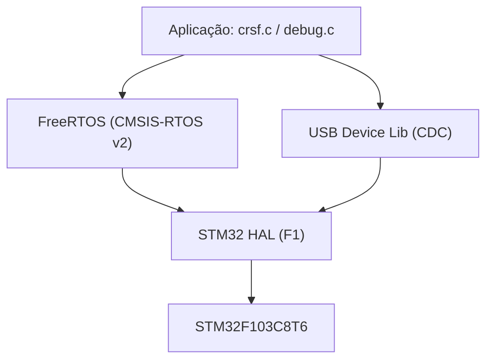

# Arquitetura de Firmware

## Camadas

## Arquivos do usuário (não-gerados)
| Arquivo | Papel |
|---------|-------|
| `Core/Src/crsf.c` + `Core/Inc/crsf.h` | Núcleo: parse JSON, conversão, montagem e envio CRSF, failsafe. Ver [[Driver CRSF]] |
| `Core/Src/debug.c` + `Core/Inc/debug.h` | Log por USART2. Ver [[Debug UART]] |
| `USB_DEVICE/App/usbd_cdc_if.c` | Recepção USB → acumula até `\n` → chama `crsf_usb_receive()`. Ver [[USB CDC (VCP)]] |
| `Core/Src/main.c` | Init de clock/GPIO/UART/DMA, criação das tasks |
| `Core/Src/freertos.c` | Hooks/configuração FreeRTOS gerada |

## Estrutura de execução
1. `main()` → init HAL, clock 72 MHz, GPIO, DMA, USART1, USART2.
2. `osKernelInitialize()` cria duas tasks (ver [[Tasks FreeRTOS]]).
3. `osKernelStart()` entrega o controle ao scheduler.
4. **defaultTask** inicializa USB e pisca o LED (heartbeat).
5. **CRSF_task** roda o laço principal de transmissão a 150 Hz.

## Modelo de concorrência
- Dados de controle (`g_direcao`, `g_throttle`, `g_last_rx_tick`, `g_last_seq`) são `volatile`, escritos no **callback USB** (contexto de interrupção) e lidos na **CRSF_task**.
- Leitura na task é protegida por `taskENTER_CRITICAL()/taskEXIT_CRITICAL()` (snapshot atômico).
- ACK é montado na ISR (`g_ack_pending`) e **enviado pela task** (fora da ISR) via `CDC_Transmit_FS`.

> [!tip] Decisão de design
> O envio CRSF e o ACK ficam concentrados na task de alta prioridade para manter o *timing* de 150 Hz previsível; a ISR USB só copia dados e levanta flags. Ver [[ADR-002 Host envia JSON via USB CDC]].

## Relacionadas
- [[Tasks FreeRTOS]]
- [[Driver CRSF]]
- [[Visão Geral do Projeto]]
