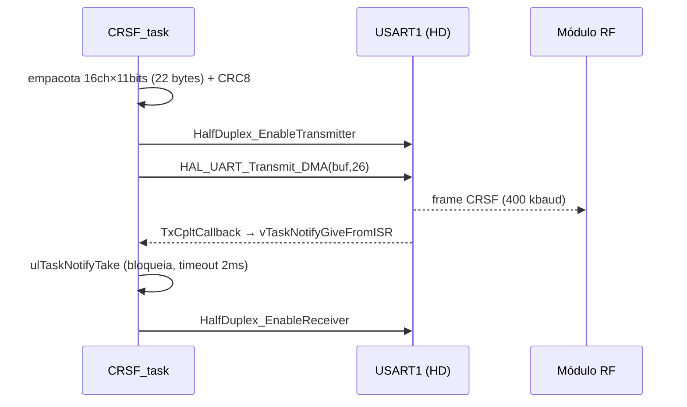

# Driver CRSF (`crsf.c` / `crsf.h`)

Núcleo do firmware. Converte comandos do host em frames [[Protocolo CRSF|CRSF RC_CHANNELS]] e transmite por USART1 half-duplex.

## API pública (`crsf.h`)
```c
void     crsf_init(UART_HandleTypeDef *huart);
void     crsf_send_channels(const uint16_t ch[16]);
void     crsf_run(void *arg);
void     crsf_usb_receive(const char *json);
uint16_t crsf_from_us(int16_t us);
uint16_t crsf_from_us_dir(int16_t us);
```

## Parâmetros (`crsf.h`)
| Macro | Valor | Significado |
|-------|-------|-------------|
| `CRSF_RATE_HZ` | 150 | Taxa de envio de canais |
| `CRSF_RATE_MS` | 6 | Período (1000/150 ≈ 6,67 → 6) |
| `CRSF_COMM_TIMEOUT_MS` | 1000 | Timeout de failsafe = 1 s (resolvido em 2026-06-25) |
| `CRSF_SEQ_REPEAT_MAX` | 100 | Nº de ciclos com `seq` repetido → failsafe |
| `CRSF_SYNC_BYTE` | 0xEE | Endereço/sync (0xEE = transmitter/handset) |
| `CRSF_TYPE_RC_CHANNELS` | 0x16 | Tipo do frame |
| `CRSF_RC_FRAME_SIZE` | 26 | Tamanho total do frame RC |
| `CRSF_CH_MIN / MID / MAX` | 192 / 992 / 1792 | Faixa de unidades CRSF |

## Fluxo de transmissão (`crsf_send_channels`)


## Conversão µs → CRSF (`crsf_from_us`)
- Satura em `1000–2000 µs`.
- `≥1500`: interpola linear de `CRSF_CH_MID`(992) a `CRSF_CH_MAX`(1792).
- `<1500`: interpola de `CRSF_CH_MID` a `CRSF_CH_MIN`(192).
- `crsf_from_us_dir()` hoje é idêntica a `crsf_from_us()` (placeholder para inversão/curva de direção futura).

## Recepção USB (`crsf_usb_receive`) — roda na ISR
- Faz parse JSON manual (`json_get_int`) das chaves `direcao`, `throttle`, `seq`.
- Satura 1000–2000, atualiza variáveis `volatile`, marca `g_last_rx_tick`.
- Monta ACK `{"direcao":..,"throttle":..,"seq":..,"ok":1}` em `g_ack_buf` e levanta `g_ack_pending`.

## CRC8
- Polinômio **0xD5**, init 0, MSB-first — padrão CRSF. Calculado sobre `[type .. payload]` (23 bytes), gravado em `buf[25]`.

## Canais mapeados hoje
- `ch[0]` = direção (de `g_direcao`), `ch[1]` = throttle (de `g_throttle`), `ch[2..15]` = `CRSF_CH_MID`.

> [!success] Itens resolvidos (2026-06-25)
> - Timeout de failsafe = 1 s. Ver [[ADR-003 Estratégia de Failsafe]].
> - Busy-wait pós-DMA → substituído por notificação de tarefa (`vTaskNotifyGiveFromISR` / `ulTaskNotifyTake`). Ver [[Tasks FreeRTOS]] e [[Questões em Aberto]] (Q2).
> - Logs do laço de 150 Hz → throttled a ~1 Hz (Q3).

## Relacionadas
- [[Protocolo CRSF]] · [[Protocolo USB JSON]] · [[ADR-001 Transporte CRSF por USART1 Half-Duplex]]
