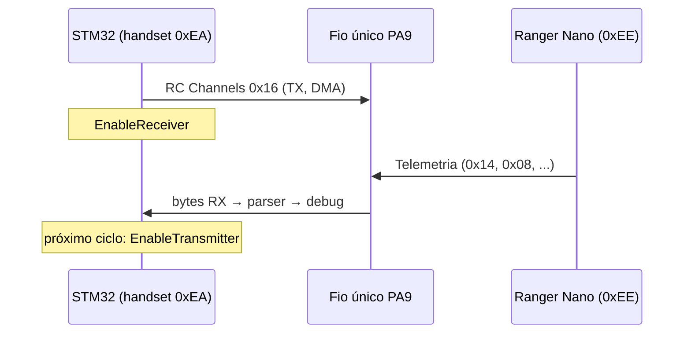
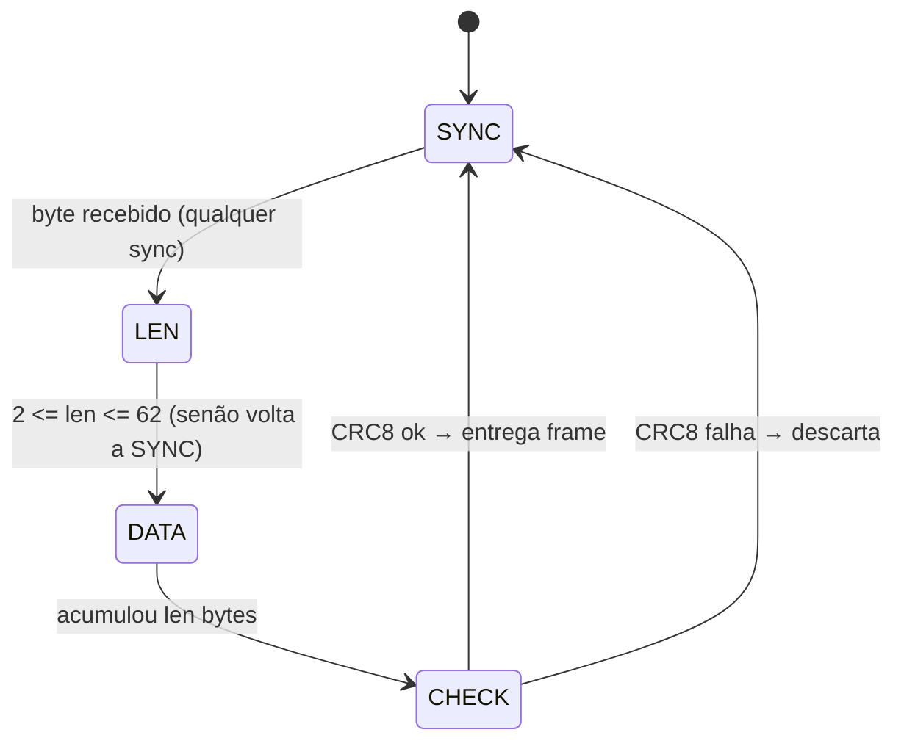

# Recepção CRSF Half-Duplex (escutar o Ranger Nano)

Design proposto para receber a [[Telemetria CRSF (RX)|telemetria]] no **mesmo fio** (USART1/PA9) já usado para TX. Ainda **não implementado** — este é o plano.

## Desafio do fio único
USART1 está em half-duplex: TX e RX compartilham PA9. O firmware já alterna transmissor/receptor em `crsf_send_channels` ([[Driver CRSF]]). Após enviar os canais, ele faz `HAL_HalfDuplex_EnableReceiver` — é justamente nessa janela que a telemetria chega. Hoje esses bytes são **descartados**.



## Abordagem recomendada de RX
1. **RX por DMA circular + IDLE line** (`HAL_UARTEx_ReceiveToIdle_DMA`): captura rajadas de tamanho variável sem saber o comprimento de antemão. A IRQ de IDLE marca o fim de cada rajada de telemetria. É o padrão para CRSF no STM32.
2. **Buffer circular** + índice de leitura; o parser consome o que chegou desde a última posição.
3. **Turnaround TX↔RX:** garantir `EnableReceiver` logo após o `TxCpltCallback` (a sincronização por notificação que já implementamos ajuda a fechar o TX no tempo certo). Cuidado para o início do próprio TX não ser lido como RX (a HAL já desabilita RX ao transmitir).

## Parser de frames (máquina de estados)
Robusto a lixo na linha e a frames partidos entre rajadas:



Regras (de [[Telemetria CRSF (RX)]]):
- **Não** exigir sync fixo; validar por `len` (2–62) **e** CRC8 (poly 0xD5 sobre Type+Payload).
- `tipo < 0x28` → header simples; `tipo >= 0x28` → header estendido (Dest/Origin antes do payload).
- Reaproveitar `crsf_crc8()` já existente.

## Modo diagnóstico (primeiro entregável)
Antes de interpretar payloads, só **logar o que chega** para identificar o que o Ranger Nano envia:
```
[RX] type=0x14 len=12 crc=OK
[RX] type=0x21 len=6  crc=OK
```
Com a lista real em mãos, implementamos o parse dos payloads de interesse (Link Statistics, Battery, etc.) e expomos via USB ([[Protocolo USB JSON]]) ou debug.

## Pontos de atenção
> [!warning] Timing — telemetria é esparsa (~5 Hz medido)
> Medição em bancada (2026-06-25): downlink a **~5,03 Hz** = **1 frame a cada ~30 ciclos** de 150 Hz. Logo, **na maioria dos ciclos a janela de RX está vazia — isso é normal, não é timeout/erro.** Consequências de design:
> - RX **assíncrono por DMA+IDLE**, desacoplado do laço; o parser só age quando um frame completo chega.
> - **Não** modelar como "lê 1 vez por ciclo com timeout" — geraria ~29 falsos timeouts por frame válido.
> - Sem pressão de tempo no parse (5 Hz sobra); o único cuidado é não bloquear o TX de 150 Hz.

> [!question] A confirmar em bancada
> - O Ranger Nano envia com sync `0xEE`, `0xEA` ou `0xC8`? (o parser sync-agnóstico cobre os três)
> - Linha **invertida ou não**? CRSF padrão é não-invertido em 3.3 V; confirmar no analisador lógico.
> - Há colisão se o TX começar antes de a telemetria terminar? Ajustar a janela de RX.

## Implementação (modo dump) — feito 2026-06-25
> [!success] Implementado via interrupção RXNE + ring buffer
> Em vez de DMA+IDLE (que entrelaça o estado da HAL com o TX-DMA no half-duplex), optou-se por RXNE em nível de registrador. Detalhes e justificativa em [[ADR-004 Recepção de Telemetria (modo dump)]].
> - `crsf_uart_irq_handler()` (ISR, lê `USART1->DR`, empilha em `rx_ring[256]`) — chamada por `USART1_IRQHandler`.
> - `__HAL_UART_ENABLE_IT(huart1, UART_IT_RXNE)` em `crsf_init`.
> - `crsf_rx_poll()` no laço: drena o ring, parser `SYNC→LEN→DATA`, valida len+CRC, loga `[RX] type=.. len=.. crc=..` na USART2.
> - Lógica do parser validada em simulação contra os frames capturados (0x14, 0x3A e um corrompido).

## Próximos passos
1. **Validar o dump em bancada** (deve aparecer `[RX] type=0x14 ... OK` e `type=0x3A ... OK` a ~4,8 Hz).
2. Parse estruturado de `0x14` (RSSI como **int8**) e `0x3A`; expor via [[Protocolo USB JSON]].
3. (Opcional) sincronismo de fase usando o `offset` do `0x3A` → ADR-005.

## Relacionadas
- [[Telemetria CRSF (RX)]] · [[Driver CRSF]] · [[Tasks FreeRTOS]] · [[Pinout STM32F103C8]]
