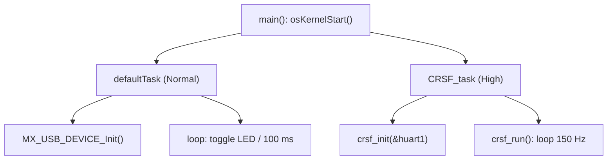

# Tasks FreeRTOS

RTOS: **FreeRTOS** via **CMSIS-RTOS v2**, alocação com `heap_4`.

## Tasks criadas em `main()`

| Task | Entry | Prioridade | Stack | Função |
|------|-------|-----------|-------|--------|
| `defaultTask` | `StartDefaultTask` | `osPriorityNormal` | 128 × 4 = 512 B | Init do USB + heartbeat do LED (toggle a cada 100 ms) |
| `CRSF_task` | `CRSF_task_Entry` | `osPriorityHigh` | 256 × 4 = 1024 B | `crsf_init()` + `crsf_run()` — laço de TX a 150 Hz |

## defaultTask
- Chama `MX_USB_DEVICE_Init()` **dentro da task** (não em `main()`), garantindo USB inicializado após o scheduler subir.
- Loop: `HAL_GPIO_TogglePin(LED) ; osDelay(100)` → LED 5 Hz como sinal de "vivo".

## CRSF_task
- `crsf_init(&huart1)`: guarda o handle, habilita modo receptor half-duplex, loga init.
- `crsf_run()`: laço infinito — snapshot dos dados de controle, detecção de [[ADR-003 Estratégia de Failsafe|failsafe]], conversão µs→CRSF, `crsf_send_channels()`, envio de ACK e `osDelay` para fechar o período de [[Protocolo CRSF|~6.67 ms (150 Hz)]].

> [!success] Sincronização de TX por notificação (resolvido 2026-06-25)
> `crsf_send_channels()` não usa mais busy-wait. Após `HAL_UART_Transmit_DMA`, a task bloqueia em `ulTaskNotifyTake(pdTRUE, pdMS_TO_TICKS(2))`; o `HAL_UART_TxCpltCallback` (ISR do DMA) sinaliza com `vTaskNotifyGiveFromISR`. A CPU fica livre durante o DMA. O handle é capturado em `crsf_init` via `xTaskGetCurrentTaskHandle()`. Ver [[Driver CRSF]] e [[Questões em Aberto]] (Q2).
>
> Pré-requisitos confirmados na config: `INCLUDE_xTaskGetCurrentTaskHandle=1`, `configUSE_MUTEXES=1`, notificações habilitadas, e IRQ do DMA em prioridade 5 = `configMAX_SYSCALL_INTERRUPT_PRIORITY`.

## Configuração
- Detalhes de heap, tick e asserts em `Core/Inc/FreeRTOSConfig.h`.
- `configASSERT(idx == 22)` em `crsf_send_channels` valida o empacotamento de 16×11 bits.

## Relacionadas
- [[Arquitetura de Firmware]]
- [[Driver CRSF]]
