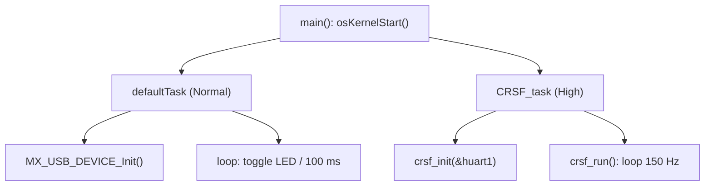

# Tasks FreeRTOS

RTOS: **FreeRTOS** via **CMSIS-RTOS v2**, alocação com `heap_4`.

## Tasks criadas em `main()`

| Task | Entry | Prioridade | Stack | Função |
|------|-------|-----------|-------|--------|
| `defaultTask` | `StartDefaultTask` | `osPriorityNormal` | 128 × 4 = 512 B | Init do USB + heartbeat do LED (toggle a cada 100 ms) |
| `CRSF_task` | `CRSF_task_Entry` | `osPriorityHigh` | 256 × 4 = 1024 B | `crsf_init()` + `crsf_run()` — laço de TX a 150 Hz |

## defaultTask
- Chama `MX_USB_DEVICE_Init()` **dentro da task** (não em `main()`), garantindo USB inicializado após o scheduler subir.
- Loop: `HAL_GPIO_TogglePin(LED) ; osDelay(100)` → LED 5 Hz como sinal de "vivo".

## CRSF_task
- `crsf_init(&huart1)`: guarda o handle, habilita modo receptor half-duplex, loga init.
- `crsf_run()`: laço infinito — snapshot dos dados de controle, detecção de [[ADR-003 Estratégia de Failsafe|failsafe]], conversão µs→CRSF, `crsf_send_channels()`, envio de ACK e `osDelay` para fechar o período de [[Protocolo CRSF|~6.67 ms (150 Hz)]].

> [!warning] Ponto de atenção — busy-wait dentro da task
> `crsf_send_channels()` faz `while(!tx_done && (HAL_GetTick()-t)<2)` após `HAL_UART_Transmit_DMA`. É uma espera ocupada (até ~2 ms) numa task de **alta prioridade**, podendo "afamar" a defaultTask/USB. Registrado em [[Questões em Aberto]].

## Configuração
- Detalhes de heap, tick e asserts em `Core/Inc/FreeRTOSConfig.h`.
- `configASSERT(idx == 22)` em `crsf_send_channels` valida o empacotamento de 16×11 bits.

## Relacionadas
- [[Arquitetura de Firmware]]
- [[Driver CRSF]]
