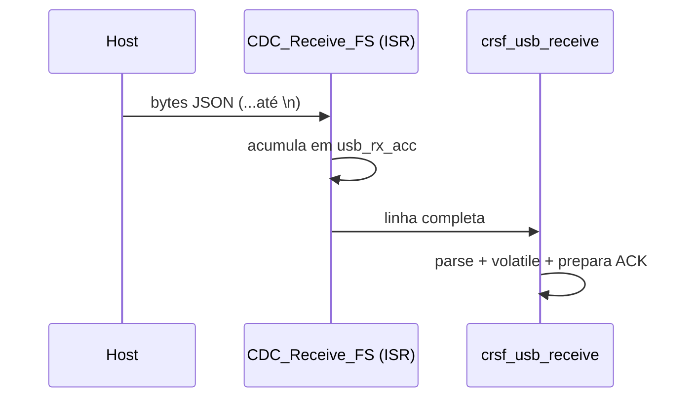

# USB CDC (VCP)

A placa se apresenta ao host como **porta serial virtual** (CDC/VCP) usando a STM32 USB Device Library.

## Recepção — `CDC_Receive_FS` (`usbd_cdc_if.c`)
- Acumula bytes em `usb_rx_acc[]` até encontrar `'\n'`.
- Ao receber `'\n'`: termina a string e chama `crsf_usb_receive(usb_rx_acc)`; reinicia o índice.
- Re-arma a recepção com `USBD_CDC_SetRxBuffer` + `USBD_CDC_ReceivePacket`.

> [!note] Framing por nova-linha
> O host **deve** terminar cada comando JSON com `\n`. Sem isso, o buffer cresce até o limite e não dispara o parse. Ver [[Protocolo USB JSON]].

## Transmissão (ACK) — `CDC_Transmit_FS`
- Chamado pela **CRSF_task** (não pela ISV) quando `g_ack_pending`.
- Envia a string ACK montada por `crsf_usb_receive`.

## Buffer
- `usb_rx_acc` protege contra overflow (`usb_rx_idx < sizeof-1`). Confirmar tamanho suficiente para o maior JSON esperado.

## Relacionadas
- [[Protocolo USB JSON]] · [[Driver CRSF]] · [[Clock e Alimentação]] (USB 48 MHz)
