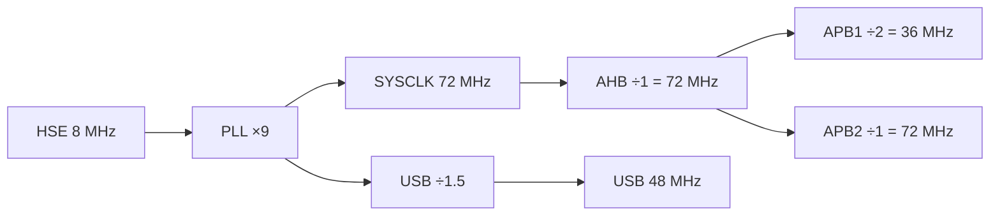

# Clock e Alimentação

Configuração extraída de `SystemClock_Config()` em `main.c`.

## Árvore de clock
- **HSE:** cristal externo 8 MHz (`RCC_HSE_ON`, prediv ÷1).
- **PLL:** fonte HSE, **×9** → **SYSCLK = 72 MHz**.
- **AHB (HCLK):** ÷1 → 72 MHz.
- **APB1 (PCLK1):** ÷2 → 36 MHz (limite do barramento APB1).
- **APB2 (PCLK2):** ÷1 → 72 MHz.
- **Flash latency:** `FLASH_LATENCY_2` (necessário acima de 48 MHz).

## Clock do USB
- `UsbClockSelection = RCC_USBCLKSOURCE_PLL_DIV1_5` → **72 / 1.5 = 48 MHz**, exato como o USB FS exige.

> [!important] Por que HSE e não HSI
> O USB Full-Speed precisa de **48 MHz exatos e estáveis**. O HSI interno (8 MHz RC) não tem precisão suficiente; por isso o projeto exige o **cristal externo de 8 MHz**. Sem HSE, a enumeração USB falha.

## Alimentação
- Blue Pill alimentada via USB (5 V → regulador 3.3 V on-board) ou 3.3 V direto.
- O módulo RF normalmente tem alimentação própria — confirmar **GND comum** entre placa, módulo e adaptador de debug. Ver [[Conexões dos Módulos]].

## Relacionadas
- [[Pinout STM32F103C8]]
- [[USB CDC (VCP)]]
