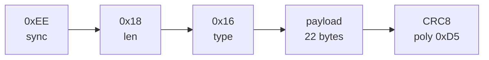

# Protocolo CRSF — RC_CHANNELS

Implementação em [[Driver CRSF]]. Saída por USART1 half-duplex @ **400000 baud**.

## Estrutura do frame (26 bytes)
| Offset | Campo | Valor | Nota |
|--------|-------|-------|------|
| 0 | Sync/Addr | `0xEE` | `CRSF_SYNC_BYTE` (endereço transmitter/handset) |
| 1 | Length | `0x18` (24) | nº de bytes após este campo (type+payload+crc) |
| 2 | Type | `0x16` | `RC_CHANNELS_PACKED` |
| 3..24 | Payload | 22 bytes | 16 canais × 11 bits = 176 bits |
| 25 | CRC8 | — | poly `0xD5` sobre bytes `[2..24]` (type+payload) |



## Empacotamento de canais
- Cada canal: 11 bits (`val & 0x7FF`), little-endian de bits acumulados em `bits`/`avail`, emitidos byte a byte.
- `configASSERT(idx == 22)` confirma exatamente 22 bytes de payload.
- Saturação por canal em `CRSF_CH_MIN`(192) / `CRSF_CH_MAX`(1792).

## Mapeamento de valores
| Pulso RC | Unidade CRSF | Constante |
|----------|--------------|-----------|
| 1000 µs | 192 | `CRSF_CH_MIN` |
| 1500 µs | 992 | `CRSF_CH_MID` |
| 2000 µs | 1792 | `CRSF_CH_MAX` |

Fórmula (ver `crsf_from_us`): interpolação linear em duas metades em torno de 1500 µs.

## CRC8
```
crc = 0
para cada byte b:
    crc ^= b
    8x: crc = (crc & 0x80) ? (crc<<1)^0xD5 : (crc<<1)
```

## Timing
- Taxa alvo **150 Hz** (`CRSF_RATE_HZ`) → período ~6,67 ms.
- A 400 kbaud, 26 bytes ≈ 0,65 ms de transmissão → folga grande no período.

> [!question] A verificar com o módulo real
> - O módulo aceita **0xEE** como endereço, ou espera **0xC8** (flight controller)? Confirmar em bancada — ver [[Log de Testes]].
> - Taxa de pacotes suportada pelo link (50/150/250 Hz conforme ELRS).

## Relacionadas
- [[Driver CRSF]] · [[Protocolo USB JSON]] · [[ADR-001 Transporte CRSF por USART1 Half-Duplex]]
