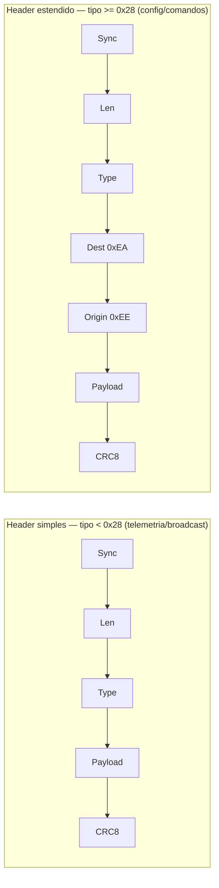

# Telemetria CRSF (RX) — mensagens do Ranger Nano → STM32

Objetivo: **identificar as mensagens que o módulo TBS Ranger Nano envia ao STM32** (que atua como handset) pelo mesmo fio half-duplex usado para o envio de canais. Baseado na especificação oficial TBS CRSF.

> [!info] Premissa física confirmada pela especificação
> O CRSF é **UART serial assíncrona single-wire half-duplex**, por padrão **400 kbaud, 8N1, 3.3 V** — exatamente o que o firmware já usa em USART1/PA9 ([[Driver CRSF]]). A telemetria volta pelo **mesmo fio**, nas janelas entre os pacotes RC. Não há hardware novo: é preciso **escutar** a linha após cada TX.

## 1. Quem fala com quem (endereçamento)

| Endereço | Dispositivo |
|----------|-------------|
| `0x00` | Broadcast |
| `0xC8` | Flight Controller |
| `0xEA` | **Remote Control (handset)** ← é o papel do STM32 |
| `0xEC` | Receptor / Crossfire Rx |
| `0xEE` | **Módulo Transmissor / Crossfire Tx** ← é o Ranger Nano |

- O STM32 **envia** canais endereçando o módulo: primeiro byte `0xEE` (já é o caso, `CRSF_SYNC_BYTE`).
- O Ranger Nano **responde** com frames cuja origem é `0xEE` e destino `0xEA` (handset).

> [!warning] Não filtre pelo "sync byte"
> A spec diz que o primeiro byte pode ser `0xC8`, `0x00` **ou um endereço de dispositivo**. O parser **não deve** exigir um valor fixo: aceite qualquer primeiro byte e **valide o frame pelo comprimento + CRC**. Em frames de header estendido, confirme `origin = 0xEE` / `dest = 0xEA`.

## 2. Estrutura do frame

Dois formatos, decididos pelo **tipo**:



- **Len** = (tamanho total do frame − 2) = bytes a partir do Type até o CRC, inclusive. Faixa válida **2 a 62**; fora disso, descartar.
- **CRC8**: polinômio **0xD5**, calculado sobre **Type + Payload** (não inclui Sync nem Len) — mesma rotina que o firmware já tem em [[Driver CRSF]]. A spec fornece versão por tabela (mais rápida) — ver [[Referências]].
- **Endianness:** big-endian (MSB primeiro) nos campos multibyte.
- Frame pode vir **maior** que o esperado (versão mais nova) → ignorar campos extras, nunca invalidar por isso.

## 3. Catálogo — o que um TX module CRSF tipicamente emite ao handset

> [!abstract] Identificação empírica recomendada
> A spec mostra o que é *possível*. O que o **seu** Ranger Nano realmente manda só se confirma **capturando a linha**. A lista abaixo é o conjunto provável; o [[#5. Como identificar na prática|modo de dump]] confirma na bancada.

### Mais prováveis / úteis
| Type | Nome | Header | Conteúdo-chave |
|------|------|--------|----------------|
| `0x14` | **Link Statistics** | simples | RSSI ant1/ant2, LQ uplink/downlink, SNR, antena ativa, perfil RF, **potência RF** |
| `0x08` | Battery Sensor | simples | tensão (10 µV), corrente (10 µA), mAh usados, % restante |
| `0x21` | Flight Mode | simples | string null-terminated (ex.: "WAIT", "!FS", "MANU") |
| `0x1E` | Attitude | simples | pitch/roll/yaw (rad × 10000) |
| `0x02` | GPS | simples | lat/lon, ground speed, heading, altitude, satélites |
| `0x3A` | Remote Related / **Timing Correction** | — | sincronismo de tempo do módulo (CRSF Shot) |
| `0x29` | Device Information | **estendido** | nome do dispositivo, serial, versões (resposta a ping `0x28`) |
| `0x2B` | Parameter Settings (Entry) | **estendido** | itens do menu LUA/config do módulo |

### 0x14 Link Statistics (payload — o mais relevante para o handset)
```c
uint8_t up_rssi_ant1;     // RSSI uplink ant1 (dBm * -1)
uint8_t up_rssi_ant2;     // RSSI uplink ant2 (dBm * -1)
uint8_t up_link_quality;  // LQ uplink (%)
int8_t  up_snr;           // SNR uplink (dB)
uint8_t active_antenna;   // melhor antena
uint8_t rf_profile;       // 0=4fps, 1=50fps, 2=150fps
uint8_t up_rf_power;      // 0=0mW,1=10,2=25,3=100,4=500,5=1000,6=2000,7=250,8=50 mW
uint8_t down_rssi;        // RSSI downlink (dBm * -1)
uint8_t down_link_quality;// LQ downlink (%)
int8_t  down_snr;         // SNR downlink (dB)
```

### 0x08 Battery Sensor
```c
int16_t  voltage;        // 10 µV/LSB
int16_t  current;        // 10 µA/LSB
uint24_t capacity_used;  // mAh
uint8_t  remaining;      // %
```

## 4. Outros tipos definidos (referência rápida)
GPS Time `0x03`, GPS Extended `0x06`, Vario `0x07`, Baro/VSpeed `0x09`, Airspeed `0x0A`, Heartbeat `0x0B`, RPM `0x0C`, Temp `0x0D`, Voltages `0x0E`, VTX `0x10`, Baro `0x11`, Magnetômetro `0x12`, Accel/Gyro `0x13`, Link Stats RX `0x1C` / TX `0x1D`, **RC Channels `0x16`** (o que o STM32 envia), Subset RC `0x17`, MAVLink `0x1F`, Ping `0x28`, Param Read `0x2C` / Write `0x2D`, Direct Commands `0x32`, Logging `0x34`, MSP `0x7A/0x7B`.

## 5b. Frames confirmados na bancada (analisador lógico, 2026-06-25)

> [!success] 0x3A.0x10 Timing Correction (CRSF Shot) — confirmado
> Capturado logo após o pacote de canais do STM32. Header **estendido**: `sync=0xC8 len=0x0D type=0x3A dest=0xEA origin=0xEE`, depois `subcmd=0x10` + payload.
> ```
> C8 0D 3A EA EE 10 00 01 04 64 00 00 72 C5 8F
> ```
> | Campo | Valor | Interpretação |
> |-------|-------|---------------|
> | `update_interval` | 66660 ×100ns | **6666 µs → 150,02 Hz** (perfil RF) |
> | `offset` | +29381 ×100ns | **+2938 µs** (positivo = dados chegaram cedo demais) |
> | CRC8 | `0x8F` | ✓ valida |
>
> Origem `0xEE` (Ranger Nano) → destino `0xEA` (handset/STM32), confirmando o endereçamento previsto.

> [!tip] Implicação de design — sincronismo de fase
> Este frame é o mecanismo de **RC-sync** do EdgeTX: o módulo informa a taxa (150 Hz, igual ao `CRSF_RATE_HZ` atual) e pede que o handset **alinhe a fase** do envio usando `offset`. Hoje o firmware usa `osDelay` fixo; usar `update_interval`/`offset` para deslizar a fase até o offset → 0 reduz latência. Opcional para funcionar, recomendado para link ótimo. Candidato a ADR-005.

> [!success] 0x14 Link Statistics — confirmado
> Header simples: `sync=0xC8 len=0x0C type=0x14` + 10 bytes payload + CRC.
> ```
> C8 0C 14 E2 00 64 0E 00 18 07 D8 64 0D DF   (CRC 0xDF ✓)
> ```
> | Campo | Byte | Valor (bancada) |
> |-------|------|-----------------|
> | up_rssi_ant1 | E2 | −30 dBm |
> | up_rssi_ant2 | 00 | inativa |
> | up_link_quality | 64 | 100 % |
> | up_snr | 0E | +14 dB |
> | active_antenna | 00 | ant1 |
> | rf_profile | 18 | índice 24 (modo RF TBS) |
> | up_rf_power | 07 | ~250 mW (enum idx 7) |
> | down_rssi | D8 | −40 dBm |
> | down_link_quality | 64 | 100 % |
> | down_snr | 0D | +13 dB |

> [!warning] RSSI é int8 com sinal neste módulo
> A spec descreve RSSI como "dBm × −1" (magnitude positiva), o que daria −226/−216 dBm. Os bytes capturados (`0xE2`/`0xD8`) só fazem sentido lidos como **`int8_t`** → −30/−40 dBm. **No parse, tratar os campos de RSSI como `int8_t`.**

> [!info] Cadência e ordem do downlink (medido 2026-06-25)
> O Ranger Nano envia a telemetria em **pares, sempre na ordem `0x14` → `0x3A`**:
> ```
> 0x14 ──9,68 ms──> 0x3A ──198,66 ms──> 0x14 ──9,68 ms──> 0x3A ──198,66 ms──> ...
> ```
> - `0x14 → 0x3A` = **9,68 ms** · `0x3A → 0x14` = **198,66 ms**
> - **Período = 208,34 ms → ~4,80 Hz** por tipo.
> - Os tempos **não** são múltiplos do TX de 150 Hz (6,67 ms) → downlink tem **clock próprio**, não sincronizado aos canais.
> - Como 9,68 ms > 6,67 ms, há ≥1 envio de canais **entre** o `0x14` e o `0x3A` → o parser deve guardar estado **entre janelas de RX** (não cabe numa só).
> - Ordem fixa (`0x14` antes de `0x3A`) é previsível e pode ser usada para agrupar, sem depender rigidamente.

> [!success] 0x08 Battery Sensor — confirmado e decodificado (2026-06-25)
> ```
> C8 0A 08 00 3A 00 00 00 00 00 00 DF   (CRC 0xDF ✓)
> ```
> | Campo | Bytes | Valor |
> |-------|-------|-------|
> | voltage (int16 BE) | 00 3A = 58 | **5,8 V** (0,1 V/LSB) |
> | current (int16 BE) | 00 00 | 0,0 A (0,1 A/LSB) |
> | capacity_used (uint24) | 00 00 00 | 0 mAh |
> | remaining (uint8) | 00 | 0 % |
> Bancada: módulo reporta a própria alimentação (~5,8 V); resto zero (sem sensor/carga).

> [!warning] Unidade de tensão/corrente é 0,1/LSB (não 10 µV)
> A spec descreve `voltage` como "10 µV/LSB" → daria 0,58 mV (absurdo). O valor real só fecha como **0,1 V/LSB** (decivolts), padrão de fato do CRSF. Usar **0,1 V/LSB** (tensão) e **0,1 A/LSB** (corrente) no parse. Mesmo padrão de divergência do RSSI (`int8`).

> [!note] Correção sobre a ordem (dados reais do MCU)
> Os três tipos (`0x3A`, `0x14`, `0x08`) chegam **intercalados**, não em ordem fixa. A sequência "`0x14`→`0x3A`" vista antes era recorte de uma captura curta. Frequência observada: `0x3A` > `0x14` > `0x08`. Todos com CRC OK.

## 5. Como identificar na prática
A forma confiável de saber o que o Ranger Nano envia é um **modo diagnóstico**: habilitar RX na USART1 após cada TX, capturar os bytes, validar comprimento+CRC e imprimir no debug (USART2) algo como:

```
[RX] type=0x14 len=12 crc=OK
[RX] type=0x21 len=6  crc=OK  payload="MANU"
```

Assim a lista acima deixa de ser teórica. O desenho dessa recepção está em [[Recepção CRSF Half-Duplex]].

## Relacionadas
- [[Protocolo CRSF]] · [[Driver CRSF]] · [[Recepção CRSF Half-Duplex]] · [[Questões em Aberto]]

## Fontes
- [TBS CRSF spec (oficial)](https://github.com/tbs-fpv/tbs-crsf-spec/blob/main/crsf.md)
- [ExpressLRS crsf_protocol.h](https://github.com/ExpressLRS/ExpressLRS/blob/master/src/lib/CrsfProtocol/crsf_protocol.h)
